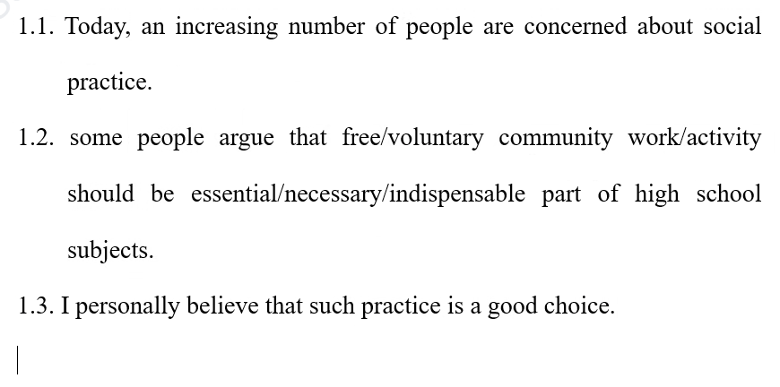

## 首段写作思路:

### 注意！！！

主语用题目原词！！！不能随意替换！！！

### 利弊类:

1. It is quite common these days that <u>题目同义改写</u>. 

   I personally believe that sth has certain drawbacks, but that these are far outweighed by the advantages it brings. 

   ("利''出现在"提问中")

   It is quite common these days that *students graduating from high schools may choose to have a break for a year to work or travel before starting university education in some countries.*

2. It is quite common these days that <u>对主题进行拓展</u>.

   I personally believe that sth has certain drawbacks, but that these are far outweighed by the advantages it brings.

   (“利”出现在“题目陈述中”)

   It is quite common these days that rich countries always give some help to those poor ones.

### 同义改写

1. 词汇：同义替换
2. 句型：
3. 修饰：v.ing/v.ed 定从

Sb be encouraged to do sth. = Sb choose to do sth.

### 一个观点 & 两个观点:

| 引题   | 拓展                                 | 观点                   |
| ------ | ------------------------------------ | ---------------------- |
| 大话题 | 一个观点，题目同义改写               | 对主题评价             |
|        | 两个观点，题目中不支持方观点同义改写 | 题中支持一方观点同义改 |

大话题：

1. 教育:作用/学费/学科/实践/学习方式
2. 科技/媒体
3. 广告
4. 环境资源
5. 动物
6. 犯罪
7. 社会:健康/交通/援助/性别平等/工作
8. 政府:投资/禁烟
9. 文化传统
10. 抽象

引题句:

1. It is quite common these days that(题目若为客观事实)
2. Thanks to technological advance, especially for the development ofcommunication technological advance,(科技/媒体)
3. Today, an increasing number of people are concerned about sth(抽象)
4. Sth plays a very important role in/sth has a larger role to play in(具体)

方法：

1. 读题判断话题类型
2. 根据话题类型选择引题句

